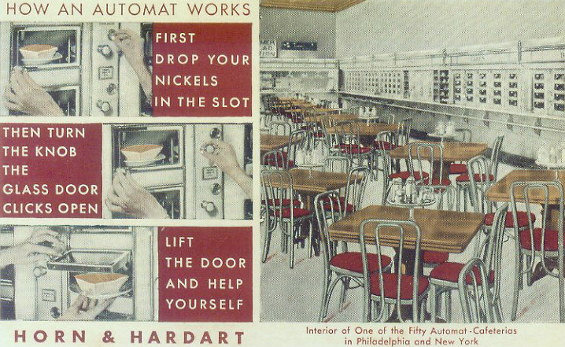
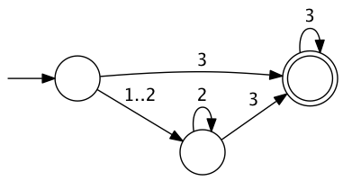

Automat is a library for defining and using finite-state automata, inspired by [Ragel](http://www.complang.org/ragel/).  However, instead of defining a DSL, it allows them to be built using simple composition of functions.

These automata, once compiled, are quite fast.  A single transition takes ~5ns, which allows around 200 million transitions a second.  This makes it appropriate for a wide variety of applications, including high-throughput parsing.

### usage

```clj
[automat "0.1.0-SNAPSHOT"]
```

A [finite-state machine](http://en.wikipedia.org/wiki/Finite-state_machine) or finite-state automaton is defined as a series of states and transitions between these states, driven by a sequence of inputs. The automaton begins at a **start state**, and proceeds through the transitions until it reaches an **accept state**.  If given an input that isn't a valid transition, the automaton may either reject the input sequence or reset to the beginning, depending on the use case.

In Automat, the simplest automaton is simply a vector representing a chain of valid inputs.

```clj
> (require '[automat.viz :refer (view)])
nil
> (require '[automat.core :as a])
nil
> (view [1 2 3])
```


The circle on the left is the start state, and the circle on the right with the double-lined border is the accept state.  Note that the transitions don't have to be numbers:

```clj
> (view [:foo "bar" 'baz])
```


Each argument to `fsm` can either be an input or another automaton.

```clj
> (view [1 [2 [3]]])
```


Note that this is identical to the first automaton.  We can also combine existing automatons using the operators in `automat.core`:

```clj
> (view (a/or [1 2 3] [1 3]))
```


This represents the **union** of the two automata, and returns an automaton which will either accept `1, 2, 3` or `1, 3`. 

If we want to accept a range of inputs, we can use `..`:

```clj
> (view [1 (a/.. 2 10) 11])
```


This will accept `1, 2, 11`, `1, 3, 11`, and so on.  If we subsequently want to narrow this, we can use `and`:

```clj
> (view 
    (a/and 
      [1 (a/.. 2 10) 11] 
      (a/or 
        [1 2 11] 
        [1 7 11])))
```


This represents the **intersection** of two automata, in this case giving us an automaton that either accepts `1, 2, 11` or `1, 7, 11`.  Note that if the intersection is empty, this will give us an automaton that cannot accept anything.

The operators `*`, `+`, and `?` behave as they do in regular expressions:

```clj
> (view [(a/? 1) (a/* 2) (a/+ 3)])
```



The `not` operator is equivalent to the regex `^` operator:

```clj
> (view [1 (a/not 2) 3])
```


In this diagram, `DEF` represents the default transition (in this case, anything but `2`), and `REJ` represents a rejection state.

### license

Copyright © 2013 Zachary Tellman

Distributed under the MIT License
